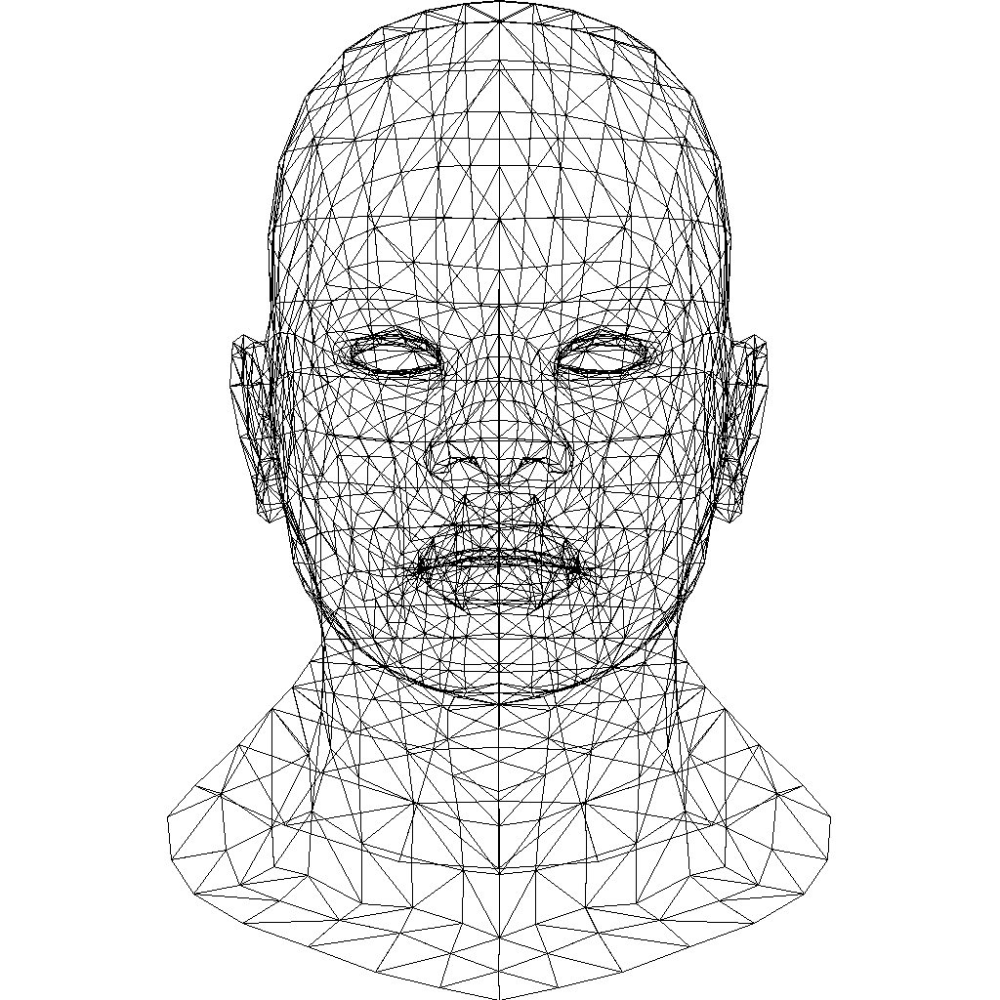
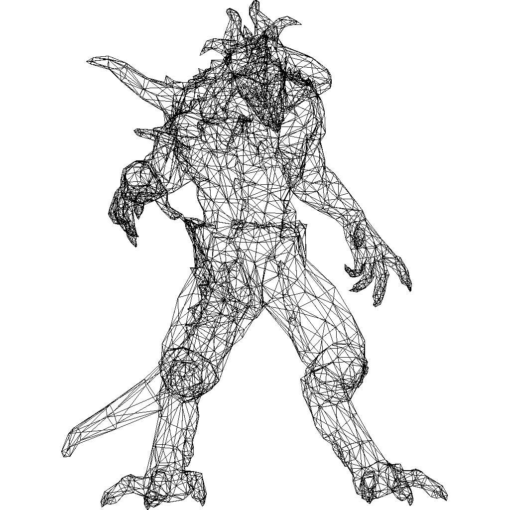

# Graphics
Computer Graphics Lab in TJU.

## 直线生成算法
- [DDA algorithm](lab-1/dda.c)  
- [Bresenham algorithm](lab-1/bresenham.c) 
   
   

## 多边形裁剪算法
- [Sutherland-Hodgman algorithm](lab-2/sutherland.c)   
  

## 使用直线算法生成图像
- [render.c](render/render.c)   
   
   
   

