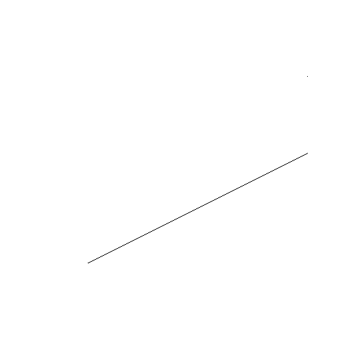
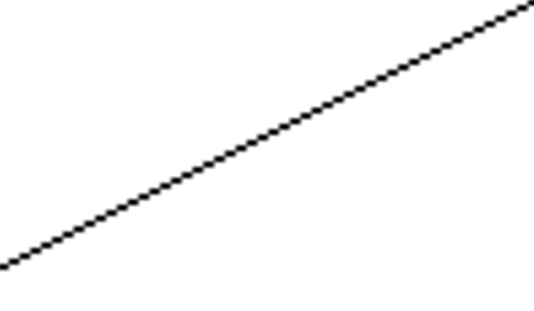
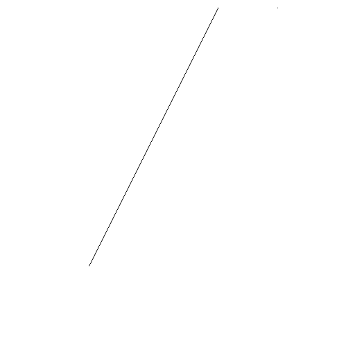
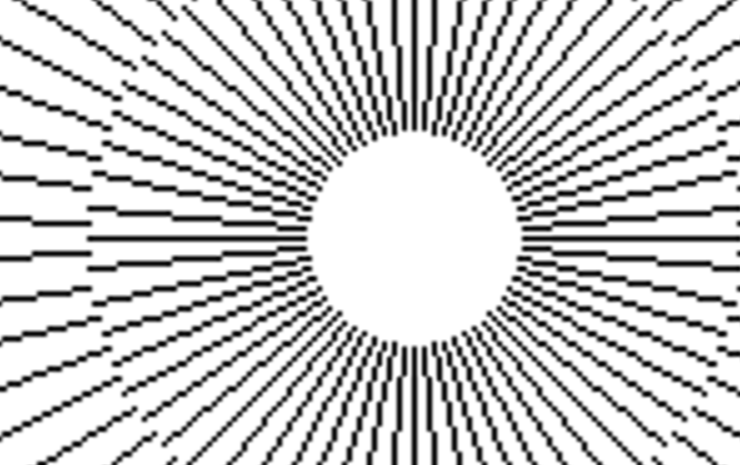
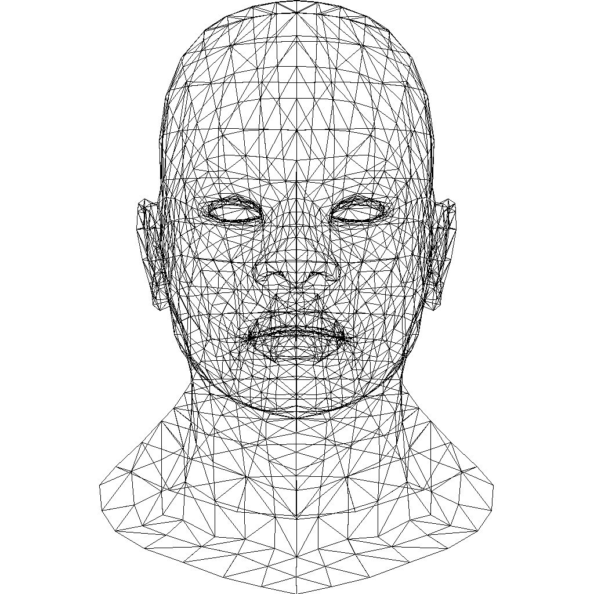
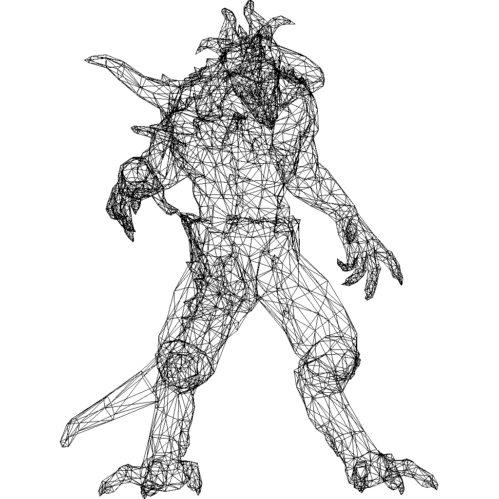

# 线画图元生成算法实验

- 姓名： 齐呈祥
- 学号： 3019244189
- 专业： 计算机科学与技术
- 班级： 4班

## 实验目的
学习如何使用编程语言生成直线

## 实验内容
- 实现 DDA 直线生成算法
- 实现 Bresenham 直线生成算法

## 实验结果
使用 DDA 算法生成的直线： 

   

放大后可以看出像素点的排列:



使用 Bresenham 算法生成的直线：  



放大后依然可以看到 bresenham 算法生成直线的像素点的排列:



使用直线生成算法画的图形:





## 实验分析和总结
在本次实验中我使用了由 `miloyip` 开发的轻量级的编码 png 的库 `svpng`，我们可以自定义图片的高度和宽度，并使用 RGB 或者 RGBA 来着色。我们只需要定义一个一维数组，并在数组上将其作为像素点进行绘制即可。在生成 png 文件中的生成所有图形完全使用 C 语言手写，最后生成的可执行文件大小要远小于使用 Qt 或者 OpenGL 编写的程序。 

在本次实验中我分别使用了 `DDA` 算法和 `Bresenham` 算法生成直线图形，并根据斜率不同分别针对 `Bresenham` 算法做了扩展，最终生成了各个方向不同的直线。更加深入地了解了如何使用计算机生成图形，为之后使用计算机生成更加复杂的推行奠定了基础。

## 源代码

DDA 直线生成算法：
```c
#include "svpng.h"
#include <string.h>

#define W 512
#define H 512


unsigned char* dda(int start_x, int start_y, int end_x, int end_y) {
    unsigned char* img = (unsigned char*)malloc(W * H * 3 * sizeof(unsigned char));
    memset(img, 255, W * H * 3);

    // 由于图片是从最顶点开始算，因此我们需要将指针移到底部
    unsigned char* bottle = img + (W * H * 3);
    // 首先给起点和终点加上像素
    unsigned char* start_ptr = bottle - (start_y * W + (W - start_x)) * 3;
    *start_ptr++ = (unsigned char)0;
    *start_ptr++ = (unsigned char)0;
    *start_ptr++ = (unsigned char)0;

    unsigned char* end_ptr = bottle - (end_y * W + (W - end_x)) * 3;
    *end_ptr++ = (unsigned char)0;
    *end_ptr++ = (unsigned char)0;
    *end_ptr++ = (unsigned char)0;

    // 此时从起始点开始迭代直到终点
    int next_x = start_x;
    float next_y = start_y;
    float k = (end_y - start_y)/(end_x - start_x);
    while(next_x < end_x) {
        next_x += 1;
        next_y = next_y + k + 0.5;
        int y_pos = (int)next_y;
        int x_pos = next_x;

        unsigned char* ptr = bottle - (y_pos * W + (W - x_pos)) * 3;
        *ptr++ = (unsigned char)0;
        *ptr++ = (unsigned char)0;
        *ptr++ = (unsigned char)0;
    }

    return img;
}

int main() {
    int start_x = 128;
    int start_y = 128;
    int end_x = 448;
    int end_y = 400;
    unsigned char* img = dda(start_x, start_y, end_x, end_y);
    svpng(fopen("dda.png", "wb"), W, H, img, 0);
    return 0;
}
```

Bresenham 直线生成算法：
```c
#include "svpng.h"
#include <stdlib.h>
#include <string.h>
#include <math.h>

#define W 512
#define H 512
#define PI 3.14159265359f

static unsigned char img[W * H * 3];

void setpixel(int x, int y) {
    // 根据坐标获取像素点指针进行绘制
    unsigned char* p = img + (W * (H - y - 1) + x) * 3;;
    p[0] = (unsigned char)0;
    p[1] = (unsigned char)0;
    p[2] = (unsigned char)0;
}

void bresenham(int x0, int y0, int x1, int y1) {
    int dx = abs(x1 - x0), sx = x0 < x1 ? 1 : -1;
    int dy = abs(y1 - y0), sy = y0 < y1 ? 1 : -1;
    // 通过斜率来为err赋值
    int err = (dx > dy ? dx : -dy) / 2;

    // 绘制像素点直到x0和x1重合或者y0和y1重合
    while (setpixel(x0, y0), x0 != x1 || y0 != y1) {
        int e2 = err;
        // 本质上是通过e2判断此时应向宽延展还是应该向高延展
        // 根据决策函数 pk+1 - pk = 2*dy(1 | 0) - 2*dx(1 | 0)
        if (e2 > -dx) { err -= dy; x0 += sx; }
        if (e2 <  dy) { err += dx; y0 += sy; }
    }
}

int main() {
    memset(img, 255, W * H * 3);
    float cx = W * 0.5f - 0.5f, cy = H * 0.5f - 0.5f;
    for (int j = 0; j < 5; j++) {
        float r1 = fminf(W, H) * (j + 0.5f) * 0.085f;
        float r2 = fminf(W, H) * (j + 1.5f) * 0.085f;
        float t = j * PI / 64.0f;
        for (int i = 1; i <= 64; i++, t += 2.0f * PI / 64.0f) {
            float ct = cosf(t), st = sinf(t);
            bresenham((int)(cx + r1 * ct), (int)(cy - r1 * st), (int)(cx + r2 * ct), (int)(cy - r2 * st));
        }
    }
    svpng(fopen("bresenham.png", "wb"), W, H, img, 0);
    return 0;
}
```