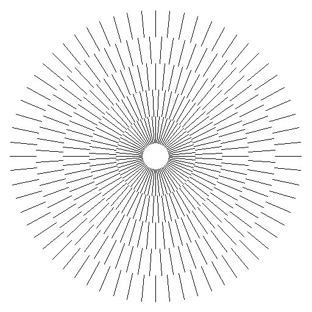

# 线画图元生成算法实验

## 实验目的
学习如何使用编程语言生成直线

## 实验内容
- 实现 DDA 直线生成算法
- 实现 Bresenham 直线生成算法

## 实验结果
使用 DDA 算法生成的直线： 
   

   
   
使用 Bresenham 算法生成的直线：  
   



## 实验分析和总结
在本次实验中我使用了由 `miloyip` 开发的轻量级的编码 png 的库 `svpng`，我们可以自定义图片的高度和宽度，并使用 RGB 或者 RGBA 来着色。我们只需要定义一个一维数组，并在数组上将其作为像素点进行绘制即可。  
   
在本次实验中我分别使用了 `DDA` 算法和 `Bresenham` 算法生成直线图形，并根据斜率不同分别针对 `Bresenham` 算法做了扩展，更加深入地了解了如何使用计算机生成图形，为之后使用计算机生成更加复杂的推行奠定了基础。

## 源代码

DDA 直线生成算法：
```c
#include "svpng.h"
#include <string.h>

#define W 512
#define H 512


unsigned char* dda(int start_x, int start_y, int end_x, int end_y) {
    unsigned char* img = (unsigned char*)malloc(W * H * 3 * sizeof(unsigned char));
    memset(img, 255, W * H * 3);

    // 由于图片是从最顶点开始算，因此我们需要将指针移到底部
    unsigned char* bottle = img + (W * H * 3);
    // 首先给起点和终点加上像素
    unsigned char* start_ptr = bottle - (start_y * W + (W - start_x)) * 3;
    *start_ptr++ = (unsigned char)0;
    *start_ptr++ = (unsigned char)0;
    *start_ptr++ = (unsigned char)0;

    unsigned char* end_ptr = bottle - (end_y * W + (W - end_x)) * 3;
    *end_ptr++ = (unsigned char)0;
    *end_ptr++ = (unsigned char)0;
    *end_ptr++ = (unsigned char)0;

    // 此时从起始点开始迭代直到终点
    int next_x = start_x;
    float next_y = start_y;
    float k = (end_y - start_y)/(end_x - start_x);
    while(next_x < end_x) {
        next_x += 1;
        next_y = next_y + k + 0.5;
        int y_pos = (int)next_y;
        int x_pos = next_x;

        unsigned char* ptr = bottle - (y_pos * W + (W - x_pos)) * 3;
        *ptr++ = (unsigned char)0;
        *ptr++ = (unsigned char)0;
        *ptr++ = (unsigned char)0;
    }

    return img;
}

int main() {
    int start_x = 128;
    int start_y = 128;
    int end_x = 448;
    int end_y = 400;
    unsigned char* img = dda(start_x, start_y, end_x, end_y);
    svpng(fopen("dda.png", "wb"), W, H, img, 0);
    return 0;
}
```

Bresenham 直线生成算法：
```c
#include "svpng.h"
#include <stdlib.h>
#include <string.h>

#define W 512
#define H 512

unsigned char* bresenham(int start_x, int start_y, int end_x, int end_y) {
    unsigned char* img = (unsigned char*)malloc(W * H * 3 * sizeof(unsigned char));
    memset(img, 255, W * H * 3);
    // 由于图片是从最顶点开始算，因此我们需要将指针移到底部
    unsigned char* bottle = img + (W * H * 3);
    // 首先给起点和终点加上像素
    unsigned char* start_ptr = bottle - (start_y * W + (W - start_x)) * 3;
    *start_ptr++ = (unsigned char)0;
    *start_ptr++ = (unsigned char)0;
    *start_ptr++ = (unsigned char)0;

    unsigned char* end_ptr = bottle - (end_y * W + (W - end_x)) * 3;
    *end_ptr++ = (unsigned char)0;
    *end_ptr++ = (unsigned char)0;
    *end_ptr++ = (unsigned char)0;

    int pos_x = start_x;
    int pos_y = start_y;
    int prev_pos_y = start_y;
    int prev_pos_x = start_x;
    int diff_x = end_x - start_x;
    int diff_y = end_y - start_y;
    float k = diff_x == 0 ? 1 << 16: (diff_y / diff_x);
    int p = 0;
    // 根据斜率的不同进行绘制
    if(k >= 1) {
        p = 2 * diff_x - diff_y;
        while(pos_y < end_y) {
            prev_pos_x = pos_x;
            pos_y += 1;
            if (p > 0) {
                pos_x += 1;
            }
            p = 2 * diff_x - 2 * diff_y * (pos_x - prev_pos_x);
            unsigned char* ptr = bottle - (pos_y * W + (W - pos_x)) * 3;
            *ptr++ = (unsigned char)0;
            *ptr++ = (unsigned char)0;
            *ptr = (unsigned char)0;
        }
    }else if(k >= 0 && k < 1) {
        p = 2 * diff_y - diff_x;
        while(pos_x < end_x) {
            prev_pos_y = pos_y;
            pos_x += 1;
            if (p > 0) {
                pos_y += 1;
            }
            p = 2 * diff_y - 2 * diff_x * (pos_y - prev_pos_y);
            unsigned char* ptr = bottle - (pos_y * W + (W - pos_x)) * 3;
            *ptr++ = (unsigned char)0;
            *ptr++ = (unsigned char)0;
            *ptr = (unsigned char)0;
        }
    }
    return img;
}

int main() {
    int start_x = 128;
    int start_y = 128;
    int end_x = 400;
    int end_y = 500;
    unsigned char* img = bresenham(start_x, start_y, end_x, end_y);
    svpng(fopen("bresenham.png", "wb"), W, H, img, 0);
    return 0;
}
```