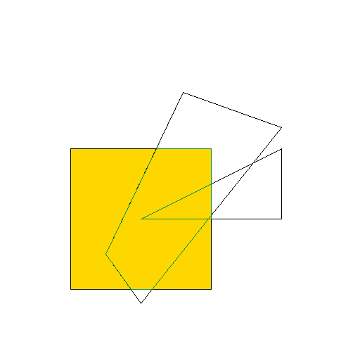

# 裁剪算法实验

- 姓名：齐呈祥
- 学号：3019244189
- 专业：计算机科学与技术
- 班级：4班

## 实验目的
学习如何使用编程语言实现裁剪算法

## 实验内容
- 实现 Cohen-Sutherland 直线裁剪算法（选做）
- 实现 Sutherland-Hodgman 多边形裁剪算法

## 实验结果
  


放大后可以看到像素点：

## 实验分析和总结
在本次实验中我同样使用了由 `miloyip` 开发的轻量级的编码 png 的库 `svpng`，我们可以自定义图片的高度和宽度，并使用 RGB 或者 RGBA 来着色。我们只需要定义一个一维数组，并在数组上将其作为像素点进行绘制即可。在生成 png 文件中的生成所有图形完全使用 C 语言手写，最后生成的可执行文件大小要远小于使用 Qt 或者 OpenGL 编写的程序。 

在生成二维图形的画线算法使用的是 bresenham 算法，由于 bresenham 算法只能绘制斜率处于 0，1 之间的直线，因此我们将其进行了扩展，使其可以绘制任意方向的直线。同时，我也实现了一些基础的数据结构如 `queue` 更便于处理由直线围成的平面。

在本次实验中我使用 C 语言实现了 Sutherland-Hodgman 多边形裁剪算法，其中涉及到画线算法与如何组织利用线画出图形，更加深刻地理解了图形学的基本算法的实现。

## 源代码
```c
#include <stdlib.h>
#include <string.h>
#include <math.h>
#include "svpng.h"

#define QUEUE_SIZE 10

#define W 512
#define H 512

unsigned char img[W * H * 3];

typedef struct position {
    int x;
    int y;
}position;

typedef struct queue {
    position queue[QUEUE_SIZE];
    int size;
}queue;

typedef struct Color {
    unsigned char r;
    unsigned char g;
    unsigned char b;
}Color;

void set_color(Color* c, int r, int g, int b) {
    c->r = (unsigned char)r;
    c->g = (unsigned char)g;
    c->b = (unsigned char)b;
}

void queue_init(queue* q) {
    q->size = 0;
}

void push(queue* q, position p) {
    q->queue[q->size] = p;
    q->size += 1;
}

int pop(queue* q, position* p) {
    if(q->size) {
        if(p != NULL) { *p = q->queue[0]; }
        for(int i = 1; i < q->size; i++) {
            q->queue[i - 1] = q->queue[i];
        }
        q->size--;
        return 1;
    }else {
        return 0;
    }
}

int front(queue* q, position* p) {
    if(q->size) {
        if(p != NULL) { *p = q->queue[0]; }
        return 1;
    }else {
        return 0;
    }
}


int size(queue* q) {
    return q->size;
}


void setpixel(int x, int y, Color c) {
    unsigned char* p = img + (W * (H - y - 1) + x) * 3;;
    p[0] = c.r;
    p[1] = c.g;
    p[2] = c.b;
}


void draw_line(int x0, int y0, int x1, int y1, Color c) {  
    int dx = abs(x1 - x0), sx = x0 < x1 ? 1 : -1;
    int dy = abs(y1 - y0), sy = y0 < y1 ? 1 : -1;
    int err = (dx > dy ? dx : -dy) / 2;

    while (setpixel(x0, y0, c), x0 != x1 || y0 != y1) {
        int e2 = err;
        if (e2 > -dx) { err -= dy; x0 += sx; }
        if (e2 <  dy) { err += dx; y0 += sy; }
    }
}


void draw_frame(int start_x, int start_y, int end_x, int end_y, Color c) {
    draw_line(start_x, start_y, end_x, start_y, c);
    draw_line(start_x, start_y, start_x, end_y, c);
    draw_line(end_x, start_y, end_x, end_y, c);
    draw_line(start_x, end_y, end_x, end_y, c);
}

void draw2graph(queue q, Color c) {
    int side_size = size(&q);
    printf("[Debug] side_size: %d\n", side_size);
    for(int i = 0; i < side_size; i++) {
        position p1, p2;
        pop(&q, &p1);
        front(&q, &p2);
        if(i == 0) {
            push(&q, p1);
        }
        printf("[Debug] p1: (%d, %d) p2: (%d, %d)\n", p1.x, p1.y, p2.x, p2.y);
        draw_line(p1.x, p1.y, p2.x, p2.y, c);
    }
}

void sutherland_hodgman(queue q, int start_x, int start_y, int end_x, int end_y, Color c) {
    for(int i = 0; i < 4; i++) {
        if(i == 0) {
            // 左裁剪
            int side_size = size(&q);
            for(int j = 0; j < side_size; j++) {
                position p1, p2;
                if(!pop(&q, &p1)) {
                    printf("[Error] 队列中无剩余节点.\n");
                    exit(0);
                }
                if(!front(&q, &p2)) {
                    printf("[Error] 队列中无剩余节点.\n");
                    exit(0);
                }
                if(j == 0) {
                    // 需要第一个节点push到队尾构造闭合曲线
                    push(&q, p1);
                }
                if(p1.x < start_x && p2.x < start_x) {
                    // 从外部到外部，不输出任何值
                    continue;
                }else if(p1.x > start_x && p2.x > start_x) {
                    // 从内部到内部，输出第二个点
                    push(&q, p2);
                    printf("[Debug] 左裁剪从内部到内部输出节点 (%d, %d)\n", p2.x, p2.y);
                }else if(p1.x < start_x && p2.x > start_x) {
                    // 从外部到内部，输出交点和第二个点
                    position p;
                    // 计算交点
                    float k = (float)(p2.y - p1.y) / (p2.x - p1.x);
                    p.y = (int)(p1.y + k * (start_x - p1.x) + 0.5f);
                    p.x = start_x;
                    push(&q, p);
                    push(&q, p2);
                    printf("[Debug] 左裁剪从外部到内部输出节点: (%d, %d), (%d, %d)\n", p.x, p.y, p2.x, p2.y);
                }else if(p1.x > start_x && p2.x < start_x) {
                    // 从内部到外部，输出交点
                    position p;
                    float k = (float)(p1.y - p2.y) / (p1.x - p2.x);
                    p.y = (int)(p2.y + k * (start_x - p2.x) + 0.5f);
                    p.x = start_x;
                    push(&q, p);
                    printf("[Debug] 左裁剪从内部到外部输出节点 (%d, %d)\n", p.x, p.y);
                }else {
                    printf("[Error] 未解决的情况.\n");
                    exit(0);
                }
            }
            pop(&q, NULL);
        }else if(i == 1) {
            // 右裁剪
            int side_size = size(&q);
            for(int j = 0; j < side_size; j++) {
                // 首先pop出第一个节点，然后取出第二个节点连成一条线
                position p1, p2;
                if(!pop(&q, &p1)) {
                    printf("[Error] 队列中无剩余节点.\n");
                    exit(0);
                }
                if(!front(&q, &p2)) {
                    printf("[Error] 队列中无剩余节点.\n");
                    exit(0);
                }
                if(j == 0) {
                    // 需要第一个节点push到队尾构造闭合曲线
                    push(&q, p1);
                }
                printf("[Debug] 右裁剪输入节点: (%d, %d), (%d, %d)\n", p1.x, p1.y, p2.x, p2.y);
                if(p1.x > end_x && p2.x > end_x) {
                    // 从外部到外部，不输出任何值
                    printf("[Debug] 右裁剪从外部到外部无输出\n");
                    continue;
                }else if(p1.x < end_x && p2.x < end_x) {
                    // 从内部到内部，输出第2个值
                    push(&q, p2);
                    printf("[Debug] 右裁剪从内部到内部输出节点: (%d, %d)\n", p2.x, p2.y);
                }else if(p1.x > end_x && p2.x < end_x) {
                    // 从外部到内部,输出交点和第2个结点
                    position p;
                    float k = (float)(p1.y - p2.y) / (p1.x - p2.x);
                    p.y = (int)(p2.y + k * (end_x - p2.x) + 0.5f);
                    p.x = end_x;
                    push(&q, p);
                    push(&q, p2);
                    printf("[Debug] 右裁剪从外部到内部输出节点: (%d, %d) (%d, %d)\n", p.x, p.y, p2.x, p2.y);
                }else if(p1.x < end_x && p2.x > end_x) {
                    // 从内部到外部，输出交点 
                    position p;
                    float k = (float)(p2.y - p1.y) / (p2.x - p1.x);
                    p.y = (int)(p1.y + k * (end_x - p1.x) + 0.5f);
                    p.x = end_x;
                    push(&q, p);
                    printf("[Debug] 右裁剪从内部到外部输出节点: (%d, %d)\n", p.x, p.y);
                }else {
                    printf("[Error] 未解决的情况.\n");
                    exit(0);
                }
            }
            pop(&q, NULL);
        }else if(i == 2) {
            // 下裁剪
            int side_size = size(&q);
            for(int j = 0; j < side_size; j++) {
                // 首先pop出第一个节点，然后取出第二个节点连成一条线
                position p1, p2;
                if(!pop(&q, &p1)) {
                    printf("[Error] 队列中无剩余节点.\n");
                    exit(0);
                }
                if(!front(&q, &p2)) {
                    printf("[Error] 队列中无剩余节点.\n");
                    exit(0);
                }
                if(j == 0) {
                    // 需要第一个节点push到队尾构造闭合曲线
                    push(&q, p1);
                }
                printf("[Debug] 下裁剪输入节点: (%d, %d), (%d, %d)\n", p1.x, p1.y, p2.x, p2.y);
                if(p1.y < start_y && p2.y < start_y) {
                    // 从外部到外部，不输出任何值
                    printf("[Debug] 下裁剪从外部到外部无输出\n");
                    continue;
                }else if(p1.y > start_y && p2.y > start_y) {
                    // 从内部到内部，输出第2个值
                    push(&q, p2);
                    printf("[Debug] 下裁剪从内部到内部输出节点: (%d, %d)\n", p2.x, p2.y);
                }else if(p1.y < start_y && p2.y > start_y) {
                    // 从外部到内部,输出交点和第2个结点
                    position p;
                    float k = (float)(p2.x - p1.x) / (p2.y - p1.y);
                    p.x = (int)(p1.x + k * (start_y - p1.y) + 0.5f);
                    p.y = start_y;
                    push(&q, p);
                    push(&q, p2);
                    printf("[Debug] 下裁剪从外部到内部输出节点: (%d, %d) (%d, %d)\n", p.x, p.y, p2.x, p2.y);
                }else if(p1.y > start_y && p2.y < start_y) {
                    // 从内部到外部，输出交点 
                    position p;
                    float k = (float)(p2.x - p1.x) / (p2.y - p1.y);
                    printf("[Debug] k: %f, dx: %d\n", k, (start_y - p1.y));
                    p.x = (int)(p1.x + k * (start_y - p1.y) + 0.5f);
                    p.y = start_y;
                    push(&q, p);
                    printf("[Debug] 下裁剪从内部到外部输出节点: (%d, %d)\n", p.x, p.y);
                }else {
                    printf("[Error] 未解决的情况.\n");
                    exit(0);
                }
            }
            pop(&q, NULL);
        }else if(i == 3) {
            // 上裁剪
            int side_size = size(&q);
            for(int j = 0; j < side_size; j++) {
                // 首先pop出第一个节点，然后取出第二个节点连成一条线
                position p1, p2;
                if(!pop(&q, &p1)) {
                    printf("[Error] 队列中无剩余节点.\n");
                    exit(0);
                }
                if(!front(&q, &p2)) {
                    printf("[Error] 队列中无剩余节点.\n");
                    exit(0);
                }
                if(j == 0) {
                    // 需要第一个节点push到队尾构造闭合曲线
                    push(&q, p1);
                }
                printf("[Debug] 上裁剪输入节点: (%d, %d), (%d, %d)\n", p1.x, p1.y, p2.x, p2.y);
                if(p1.y > end_y && p2.y > end_y) {
                    // 从外部到外部，不输出任何值
                    printf("[Debug] 上裁剪从外部到外部无输出\n");
                    continue;
                }else if(p1.y < end_y && p2.y < end_y) {
                    // 从内部到内部，输出第2个值
                    push(&q, p2);
                    printf("[Debug] 上裁剪从内部到内部输出节点: (%d, %d)\n", p2.x, p2.y);
                }else if(p1.y > end_y && p2.y < end_y) {
                    // 从外部到内部,输出交点和第2个结点
                    position p;
                    float k = (float)(p2.x - p1.x) / (p2.y - p1.y);
                    p.x = (int)(p1.x + k * (end_y - p1.y) + 0.5f);
                    p.y = end_y;
                    push(&q, p);
                    push(&q, p2);
                    printf("[Debug] 上裁剪从外部到内部输出节点: (%d, %d) (%d, %d)\n", p.x, p.y, p2.x, p2.y);
                }else if(p1.y < end_y && p2.y > end_y) {
                    // 从内部到外部，输出交点 
                    position p;
                    float k = (float)(p2.x - p1.x) / (p2.y - p1.y);
                    p.x = (int)(p1.x + k * (end_y - p1.y) + 0.5f);
                    p.y = end_y;
                    push(&q, p);
                    printf("[Debug] 上裁剪从内部到外部输出节点: (%d, %d)\n", p.x, p.y);
                }else {
                    printf("[Error] 未解决的情况.\n");
                    exit(0);
                }
            }
            pop(&q, NULL);
        }
    }
    draw2graph(q, c);
}

int main() {
    memset(img, 255, sizeof(img));
    int start_x = 100;
    int start_y = 100;
    int end_x = 300;
    int end_y = 300;
    // 绘制裁减窗口
    Color c;
    set_color(&c, 0, 0, 0);
    draw_frame(start_x, start_y, end_x, end_y, c);

    for(int i = 0; i < H; i++) {
        for(int j = 0; j < W; j++) {
            if(j > start_x && j < end_x && i > start_y && i < end_y) {
                unsigned char* ptr = img + (W * (H - i - 1) + j) * 3;
                *ptr++ = (unsigned char)255;
                *ptr++ = (unsigned char)215;
                *ptr = (unsigned char)0;
            }
        }
    }

    // 绘制第一个被裁剪图形
    position p1, p2, p3, p4;
    queue q;
    queue_init(&q);
    p1.x = 200;
    p1.y = 200;
    p2.x = 400;
    p2.y = 300;
    p3.x = 400;
    p3.y = 200;
    push(&q, p1);
    push(&q, p2);
    push(&q, p3);
    printf("[Debug] 输入节点为 (%d, %d) (%d, %d) (%d, %d)\n", p1.x, p1.y, p2.x, p2.y, p3.x, p3.y);
    draw2graph(q, c);
    set_color(&c, 0, 139, 69);
    sutherland_hodgman(q, start_x, start_y, end_x, end_y, c);

    // 绘制第2个被裁剪图形
    queue_init(&q);
    p1.x = 150;
    p1.y = 150;
    p2.x = 260;
    p2.y = 380;
    p3.x = 400;
    p3.y = 330;
    p4.x = 200;
    p4.y = 80;
    set_color(&c, 0, 0, 0);
    push(&q, p1);
    push(&q, p2);
    push(&q, p3);
    push(&q, p4);
    draw2graph(q, c);
    set_color(&c, 0, 139, 69);
    sutherland_hodgman(q, start_x, start_y, end_x, end_y, c);
    

    svpng(fopen("sutherland.png", "wb"), W, H, img, 0);
}
```